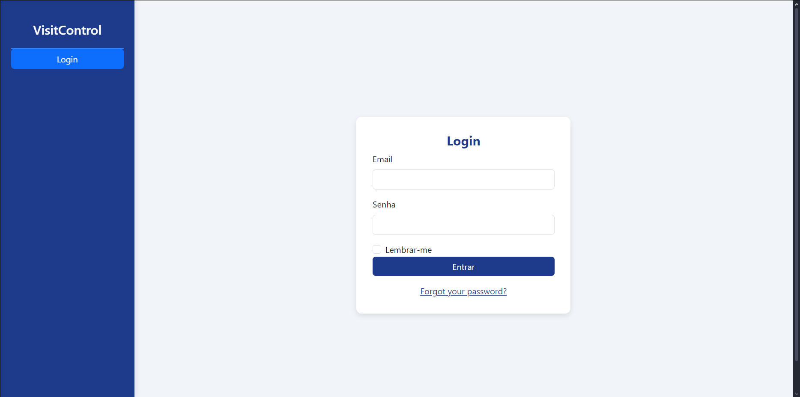
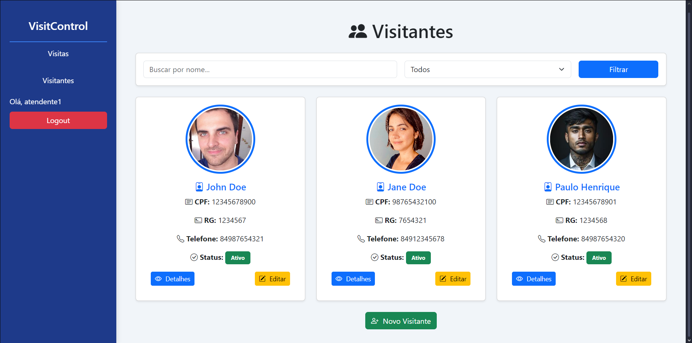
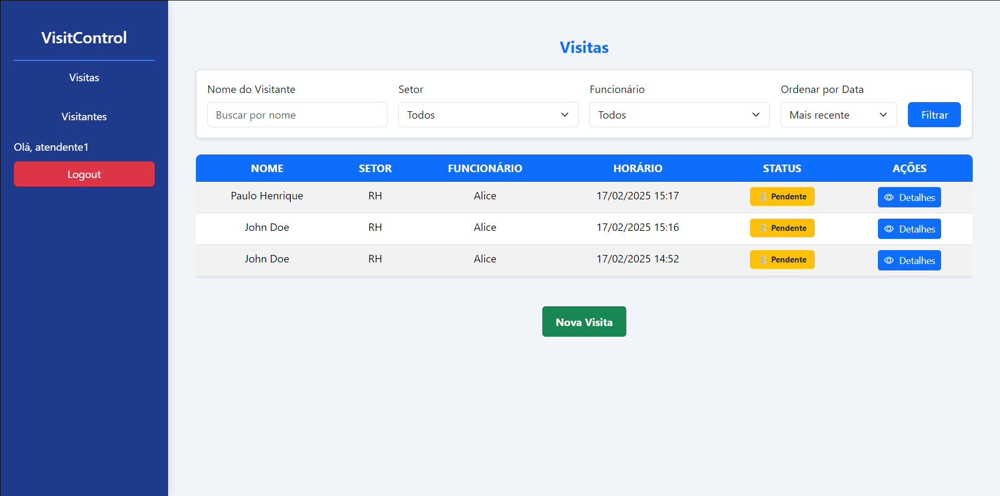
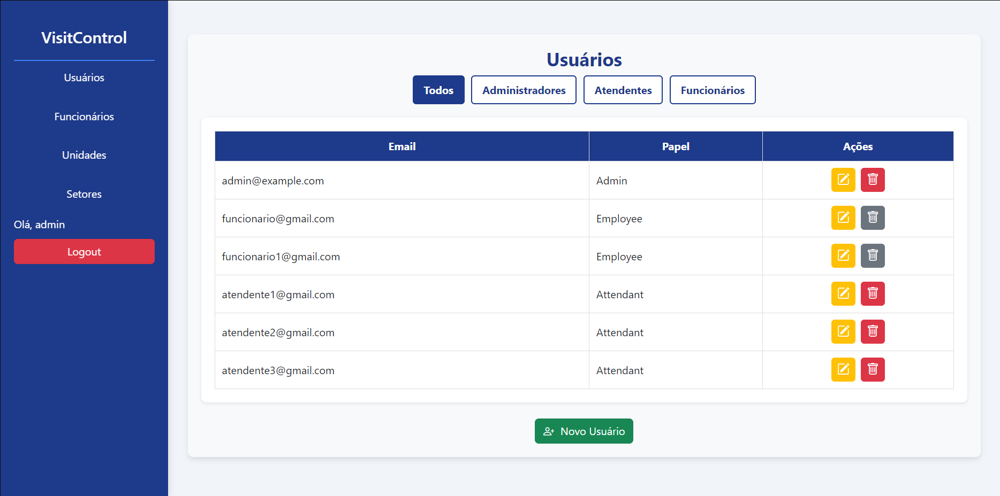
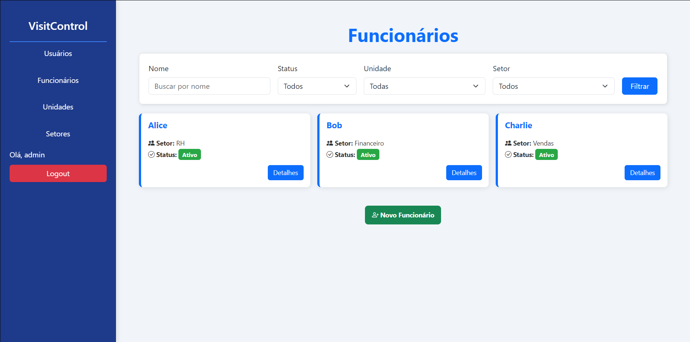
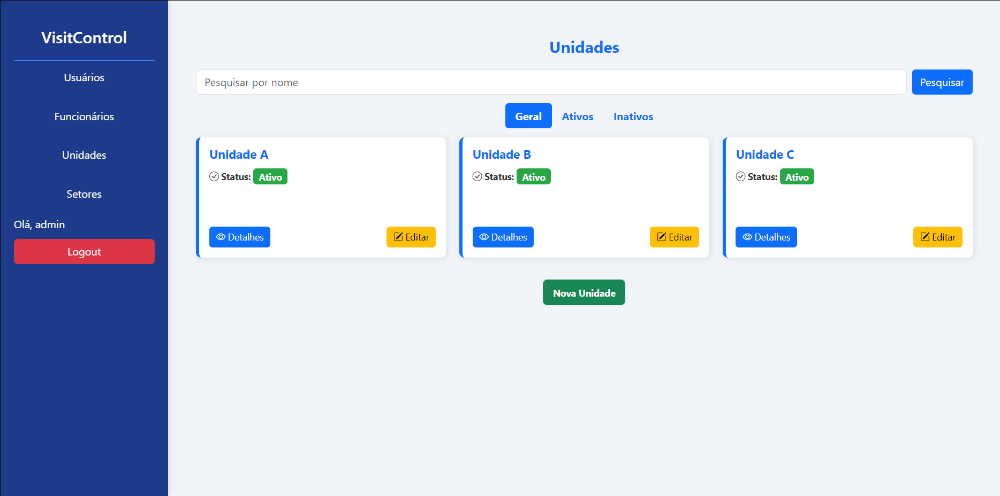
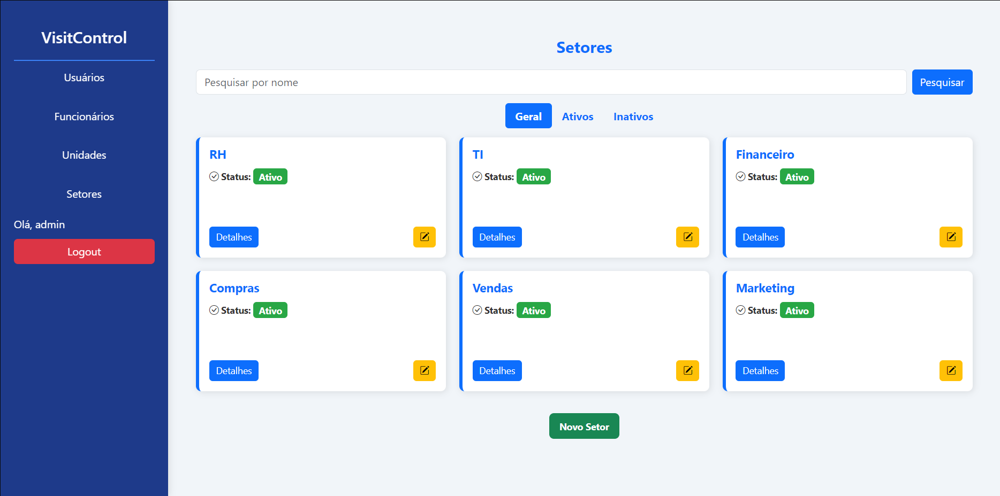

# Sistema de Registro de Visitantes (VisitControl)

## 📌 Sobre o Projeto

O **Sistema de Registro de Visitantes** tem como objetivo armazenar e gerenciar as visitas realizadas nas unidades de uma instituição. Cada unidade pode registrar apenas as visitas realizadas em seu local, mas compartilham um cadastro centralizado de visitantes para agilizar o processo de check-in.

## 🚀 Funcionalidades

### 🔹 Cadastro de Visitantes
- Registro de visitantes com CPF, nome, RG, telefone e foto (via webcam).
- Auto-preenchimento dos dados ao inserir um CPF já cadastrado.
- Atribuição de setor e funcionário para a visita.
- Registro automático de data e hora da visita.

### 🔹 Controle de Acesso
- **Administrador:** Pode administrar unidades, setores, funcionários e usuários.
- **Atendente:** Responsável pelo cadastro de visitantes e registro de visitas de sua unidade.
- **Funcionário:** Pode visualizar visitantes aguardando atendimento e notificar a realização da visita.

### 🔹 Segurança e Permissões
- Utilização da **gem Devise** para autenticação de usuários.
- Controle de permissões via **gem Cancancan**.
- Upload seguro de fotos via **gem CarrierWave**.

### 🔹 Banco de Dados
- Armazenamento seguro e eficiente com **PostgreSQL**.

## 📖 Tecnologias Utilizadas

O projeto foi desenvolvido utilizando **Ruby on Rails**, seguindo o padrão de arquitetura **MVC**.

- **Linguagem:** Ruby
- **Framework:** Ruby on Rails
- **Autenticação:** Devise
- **Autorização:** Cancancan
- **Upload de Arquivos:** CarrierWave
- **Banco de Dados:** PostgreSQL

## 🔥 Funcionalidades Adicionais

Além das funcionalidades principais descritas acima, foram implementadas as seguintes melhorias:

- **Sistema de ativação e desativação de entidades:**: Foi adicionado um campo "Active" para unidades, setores, funcionários e visitantes, permitindo a desativação sem a remoção dos dados, garantindo maior segurança e integridade do histórico de visitas.
- **Mecanismo de desativação em cascata**: Caso uma unidade seja desativada, todos os seus setores e funcionários também são automaticamente desativados, incluindo a remoção do acesso dos funcionários ao sistema.
- **Cascata de desativação**: Exemplo: Ao desativar uma unidade, todos os setores desta são desativados também e todos os funcionários de cada setor são desativados perdendo seu usuário do sistema por consequência.
- **Filtros de pesquisa avançados**: Implementação de opções de busca refinadas em todas as páginas, permitindo filtrar registros por status ativo/inativo, setor, entre outros critérios.
- **Interface responsiva**:  sistema foi projetado para ser totalmente adaptável a dispositivos móveis, proporcionando uma experiência fluida em diferentes tamanhos de tela.


## 📸 Capturas de Tela

| Tela | Imagem |
|------|--------|
| Tela de Login |  |
| Dashboard de Visitantes |  |
| Dashboard de Visitas |  |
| Dashboard de Usuários |  |
| Dashboard de Funcionários |  |
| Dashboard de Unidades |  |
| Dashboard de Setores |  |


## ⚡ Como Executar o Projeto

### 1️⃣ Pré-requisitos
- Ruby instalado (versão recomendada: `3.3.7`)
- Rails instalado (`gem install rails`)
- PostgreSQL configurado

### 2️⃣ Instalação
```bash
# Clone este repositório
git clone https://github.com/Pablosxz/sistema_visitas.git
cd sistema_visitas

# Instale as dependências
bundle install

# Configure o banco de dados
rails db:create
rails db:migrate
rails db:seed # Necessário para adicionar o usuário admin padrão e outros exemplos

# Inicie o servidor
rails server
```

O sistema estará disponível em: `http://localhost:3000`

## 🛠️ **Credenciais Padrão**

Após a instalação e execução do sistema, você pode usar as seguintes credenciais para acessar as diferentes funções do sistema:

- **Administrador:**
  - **Email:** admin@example.com
  - **Senha:** admin123
  
- **Atendente:**
  - **Email:** atendente@example.com
  - **Senha:** atendente123
  
- **Funcionário:**
  - **Email:** funcionario@example.com
  - **Senha:** funcionario123

Esses usuários são criados automaticamente durante a execução do comando `rails db:seed`.